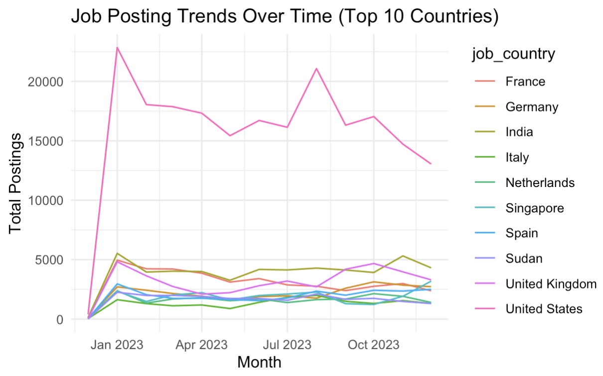

# Data Job Market Analytics: Insights into Hiring, Skills, Salaries, and Trends
## 📌 Introduction
The data job market is rapidly evolving, shaped by advancements in AI, cloud technologies, and global hiring practices. This project analyzes real-world job postings data to uncover trends in hiring companies, compensation, skills demand, and geographic distribution. By leveraging SQL for querying and aggregating, the analysis provides data-driven insights into what drives opportunities in the data field.

**Main Character (Y)**: Data-related jobs (the central narrative)
**Sub-main Characters (X)**: Salaries, Skills, Location, Company, and Time (the factors shaping the story).

The analysis treats the job market as a dynamic ecosystem where the main character (data roles) is influenced by multiple forces (sub-main characters).

## 📂 Background
* Dataset: Job postings fact table and supporting dimension tables (titles, companies, skills, location)
* Purpose: Explore hiring demand, salary structures, skills premium, and geographic distribution using SQL queries.
* Approach: A question-driven analysis where each query answers a targeted job market question.

## 🛠 Tools & Environment
* **SQL Engine**: PostgreSQL
* **IDE**: Visual Studio Code
* **Version Control**: Git, GitHub
* **Visualization & Storytelling**: R, Notion (for non-technical presentation)

→ R Visualiation Code: [R visualization Code](/project_sql/query5_visualization.r)

## 🔍 Summary of Analysis
1. **Top Hiring Companies**

|     Company Name    | Total Job Postings |     Location      |
|---------------------|--------------------|-------------------|
| Emprego             | 3,571              | Peru              |
| Emprego             | 3,071              | Argentina         |
| Booz Allen Hamilton | 2,464              | United States     |
| Confidenziale       | 2,033              | Italy             |
| Insight Global      | 1,696              | United States     |
| Capital One         | 1,667              | United States     |
| Listopro            | 1,560              | Remote (Anywhere) |
| Guidehouse          | 1,532              | United States     |
| Dice                | 1,427              | Remote (Anywhere) |
| Walmart             | 1,386              | United States     |

* Emprego (Latin America) dominated hiring, while U.S. companies like Booz Allen Hamilton, Capital One, Walmart, Insight Global were also leaders.
* Remote-first platforms (e.g., Listopro, Dice) highlighted the rise of global distributed hiring.

→ SQL queries & results: [query_1](/project_sql/1_top_hiring_companies.sql)

2. **Salary Insights**

|                  Job Title                   |   Average Salary   |
|----------------------------------------------|--------------------|
| GIS Analyst                                  | 585,000            |
| Staff Data Scientist/Quantitative Researcher | 550,000            |
| Data Engineer                                | 525,000            |
| Staff Data Scientist - Business Analytics    | 525,000            |
| VP Data Science & Reserach                   | 463,500            |

|              Job Title Short                 |   Average Salary   |
|----------------------------------------------|--------------------|
| Senior Data Scientist                        | 154,050.03         |
| Senior Data Engineer                         | 145,866.87         |
| Data Scientist                               | 135,929.48         |
| Data Engineer                                | 130,266.87         |
| Machine Learning Engineer                    | 126785.91          |

|    Remote Job    |   Average Salary   | 
|------------------|--------------------|
| Remote           | 131,779            |
| On-site          | 121,784            |

* High-paying niche roles: GIS Analysts ($585k), Quantitative Data Scientist ($550k+).
* Generalized titles: Senior Data Scientist ($154k), Senior Data Engineer ($146k).
* Remote vs On-site: Remote roles averaged ~$132k vs. ~$122k for on-site.

→ SQL queries & results: [query_2](/project_sql/2_salary_insights.sql)

3. **Skills Demand**

|      Skills      |    Demand Count    |        Skills        |   Average Salary   |
|------------------|--------------------|----------------------|--------------------|
| SQL              | 385,750            | MongoDB              | 170,714            |
| Python           | 381,863            | Cassandra            | 154,124            |
| AWS              | 145,718            | Neo4j                | 147,707            |
| Azure            | 132,851            | Scala                | 145,119            |
| R                | 131,285            | Kafka                | 144,753            |

* Most in-demand: SQL (385k postings), Python (382k postings), cloud platforms (AWS, Azure).
* High-salary premium skills: MongoDB, Cassandra, Neo4j, Scala, Kafka (~$140k-$170).
  * Demand ≠ Salary: SQL & Python are most demanded, but niche tools like 
    Cassandra/Scala  carry higher salary premiums.

→ SQL queries & results: [query_3](/project_sql/3_skills_demand.sql)

4. **Geographic Distribution**

|       Country       | Total Job Postings |    Remote Jobs    |
|---------------------|--------------------|-------------------|
| United States       | 206,943            | 23,150            |
| India               | 51,197             | 5,723             |
| United Kingdom      | 40,439             | 3,774             |
| France              | 40,028             | 1,679             |
| Germany             | 27,782             | 1,333             |
| Spain               | 25,123             | 2,650             |
| Singapore           | 23,702             | 264               |
| Sudan               | 22,519             | 3,807             |
| Netherlands         | 20,673             | 734               |
| Italy               | 17,073             | 751               |

|            Top 10 Countires           |        Top 10 Countries Remote       |
|---------------------------------------|--------------------------------------|
|      |        |

* U.S. dominates (207k postings, 23k remote).
* India, UK, France, Germany emerge as strong markets.
* Sudan surprisingly appears with 21k postings, reflecting regional hiring platforms.

→ SQL queries & results: [query_4](/project_sql/4_geographic_distribution.sql)

5. **Market Trends Over Time**

* **5-1. Job Title Trends Over Time**

|            Job Posting Trends         |
|---------------------------------------|
| |

* **5-2. Salary Trends Over Time**

|              Salary Trends            |
|---------------------------------------|
|      |

* **5-3. Geographic Trends Over Time**

|       Top 10 Job Countries      |  Top 10 Remote Job Countires  |
|---------------------------------|-------------------------------|
|      |     |

* **5-4. Skills Demand & Salary Trends Over Time**

|        Skills by Demand          |         Skills by Salary           |
|----------------------------------|------------------------------------|
|  |    |

* Salary inflation observed for senior roles and hybrid jobs.
* Remote opportunities are gaining traction globally.
* Cloud, ML/AI frameworks, and bid data tools are becoming more prominent over time.

→ SQL queries & results: [query_5](/project_sql/5_job_market_trends_over_time.sql)

→ job_title_demand_trends dataset: [query_5_1.csv](/project_sql/job_title_demand_trends.csv)

→ salary_trends dataset: [query_5_2.csv](/project_sql/salary_trends.csv)

→ job_title_geographic_trends dataset: [query_5_3.csv](/project_sql/job_title_geographic_trends.csv)

→ skill_salary_trends dataset: [query_5_4.csv](/project_sql/skill_salary_trends.csv)

## 📈 Conclusion
The market signals convergence toward advanced, engineering-heavy skill sets, remote-first hiring models, and pay stratification based on niche tool adoption. For technical professionals and hiring managers, strategic investment in cloud, AI/ML, and distributed data systems skills will maximize competitiveness.

### References
* Barousse, Luke. SQL for Data Analytics. Available at: [(https://www.youtube.com/watch?v=7mz73uXD9DA)]